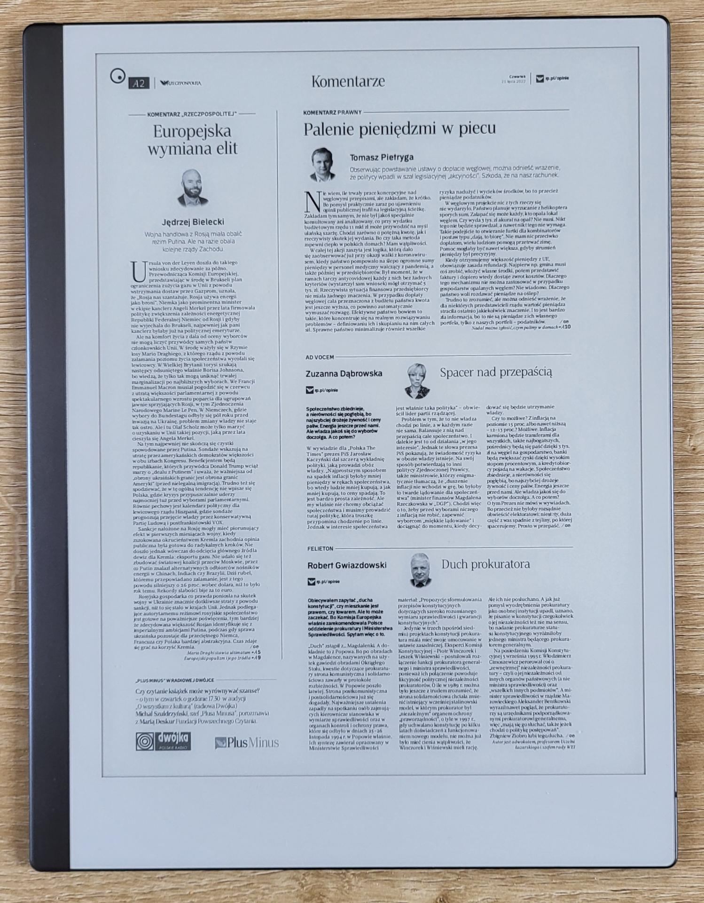

# Newspaper fetcher

Implements a simple backend that retrieves newspaper PDFs from an
online service.

This can be later consumed by e-book readers to provide a "new
newspaper every morning" experience:



## Building

The application can be build for both AMD64 and AArch64/ARM64
architectures using [Docker
BuildKit](https://docs.docker.com/develop/develop-images/build_enhancements/).

```sh
docker buildx build --push --platform linux/amd64,linux/arm64 -t wiktork/newspaper-fetcher .
```
